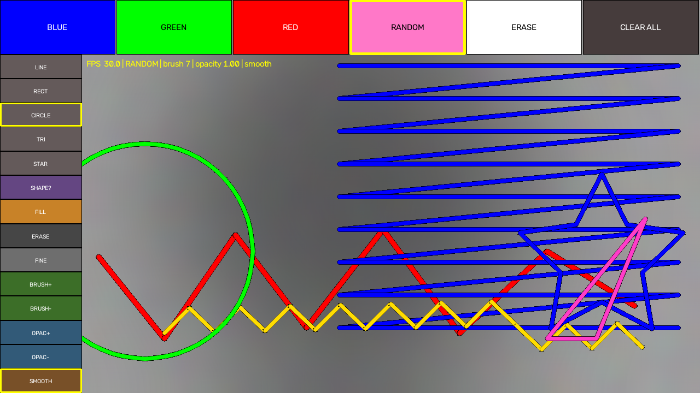

# ✋ GestureDraw — Hand-Gesture Air Canvas

**Draw, erase, undo, and export pixel art — in real time, using nothing but your hand and a webcam.**

<p align="center">
  
  
  
  
</p>

**Author:** [Mohammad Liaquat Ali](https://github.com/malik-cat)

GestureDraw turns hand gestures captured by a webcam into a virtual
whiteboard. Point with your index finger to draw, pinch to select tools and
anchor shapes, fill closed regions, switch to random colours or random
shapes, tune brush size / opacity / smoothing in real time, and export your
work as a PNG — all live, on a **full-screen mirrored** video feed.

The **v2.1 professional build** is a single-file, production-tuned app
(`gesture_draw_v2.py`) with a top colour palette, a left tool sidebar, an
interpolated + dropout-bridging stroke engine, real alpha-blended
highlighters, and deterministic random tools.

<p align="center">
  
</p>

---

## ✨ Features

- **Full-canvas drawing** — every pixel on screen is drawable, edge to
  edge; strokes are suppressed only while your fingertip is inside a UI
  panel.
- **Interpolated, zero-drop strokes** — each new fingertip point is
  connected to the previous one with `cv2.line()` so skipped MediaPipe
  frames never crack a line. If the hand disappears mid-stroke, up to
  `BRIDGE_FRAMES` (4) frames are bridged by **motion-vector
  extrapolation** before the stroke is cut.
- **Stable tool selection** — a tool fires when it is hovered for
  `STABLE_HOVER_FRAMES` (15 ≈ 0.5 s) consecutive frames **or** when a
  pinch-click releases inside the panel.
- **Three gestures:**
  - `DRAW` — index raised only → free-hand draw (pen = fingertip).
  - `HOVER / SELECT` — index + middle raised → move the cursor / pick tools.
  - `PINCH` — thumb + index together → click a tool, **anchor a shape**,
    or **flood-fill** a region.
- **Random colour tool** — `RANDOM` (top palette / sidebar / `r`) pulls a
  fresh, vivid colour from a **golden-angle HSV wheel** for every new
  stroke.
- **Shape engine** — `LINE` `RECT` `CIRCLE` `TRIANGLE` `STAR` with an
  anchor → drag → live preview → release commit workflow; `RANDOM SHAPE`
  (`g`) picks a random shape per commit.
- **BUCKET FILL** — pinch-tap inside a closed region to fill it in the
  current colour.
- **Two erasers** — a large **stroke eraser** and a **FINE (precision)
  eraser** for pixel-level touch-ups.
- **Drawing parameters** — brush thickness (`+` / `−`, sidebar buttons),
  opacity (`[` / `]` — a real alpha blend, solid pen → translucent
  highlighter), and moving-average landmark **smoothing** (`t`), all
  tunable live.
- **Guarded CLEAR ALL** — the first press arms it; a second press within
  `CLEAR_CONFIRM_S` (1 s) really wipes the canvas, so you never lose work
  to a stray pinch.
- **Undo** with `u`, **Save/Export** a timestamped PNG of just the drawing
  to `exports/` with `s`, **full-screen toggle** with `f`, **FPS meter and
  live HUD** in the corner.
- **Clean exit** — `q` releases the camera and closes every window.

---

## 📦 Requirements

| Dependency  | Version |
|-------------|---------|
| Python      | 3.11+   |
| `opencv-python` | ≥ 4.8.0 |
| `mediapipe` | ≥ 1.0.0 |
| `numpy`     | ≥ 1.24.0 |
| Webcam      | any      |

> **Note:** MediaPipe 1.0.0 removed the legacy `mp.solutions` API. This
> project uses the modern **Tasks** API (`HandLandmarker`) with the bundled
> `hand_landmarker.task` model.

---

## 🚀 Getting Started

### 1. Clone the repository

```bash
git clone https://github.com/malik-cat/GestureDraw.git
cd GestureDraw
```

### 2. Install dependencies

```bash
pip install -r requirements.txt
```

### 3. Run it

Run the **v2 production build** (single-file, recommended):

```bash
python gesture_draw_v2.py
```

Or the **v1 modular build**:

```bash
python main.py
```

The window **GestureDraw v2 – Air Canvas** opens **full screen** in a
mirrored selfie view (the left/right hand feel natural). It shows the top
palette (`BLUE` `GREEN` `RED` `RANDOM` `ERASE` `CLEAR ALL`), the left tool
sidebar, and a live FPS/HUD readout. Raise your hand and start drawing;
press `q` to quit, `f` to toggle windowed/full screen.

> **Model file:** if `hand_landmarker.task` is missing, download it from
> [Google's MediaPipe models](https://storage.googleapis.com/mediapipe-models/hand_landmarker/hand_landmarker/float16/1/hand_landmarker.task)
> and place it in the project root.
>
> `main.py` / `air_canvas.py` still work — they are the earlier **v1
> modular build** and are kept for reference; `gesture_draw_v2.py` is the
> recommended, full-featured build.

---

## 🖐️ How to Use

| Gesture                       | Action                                     |
|-------------------------------|--------------------------------------------|
| Index + middle fingers up     | Move the cursor / hover a tool (`HOVER`)    |
| Index finger up only          | Free-hand draw (`DRAW`)                    |
| Thumb + index pinch (press)   | Click a tool, **anchor a shape**, or start a fill |
| Thumb + index pinch (release) | Commit the shape / perform the fill        |
| Hand out of frame             | Stroke continues briefly (bridged), then a new stroke starts |

### Top palette & left sidebar

Hover a button for ~0.5 s or pinch-click it to activate — the active tool
is outlined in yellow:

```
Top palette:  BLUE   GREEN   RED   RANDOM   ERASE   CLEAR ALL
Left sidebar: LINE   RECT    CIRCLE  TRIANGLE  STAR
              SHAPE? FILL    ERASE   FINE     BRUSH+   BRUSH−
              OPAC+  OPAC−   SMOOTH
```

`RANDOM` recolours every new stroke from the golden-angle wheel; `SHAPE?`
commits a random shape each time you draw; `FILL` bucket-fills a closed
region; `FINE` is the precision eraser; `BRUSH±`, `OPAC±` and `SMOOTH`
tune the drawing parameters live.

### Drawing a shape

1. Pick a shape tool (`LINE` `RECT` `CIRCLE` `TRIANGLE` `STAR` or
   `SHAPE?`) from the sidebar, or press `1`–`5` / `g`.
2. **Pinch** (thumb + index) on the canvas to **anchor** the shape — a
   live translucent preview follows your fingertip.
3. Drag your finger to size it, then **release the pinch** to **commit**
   with the current colour and brush.
   A quick tap (under `FINGER_TAP_DIST` px) cancels instead of committing.

---

## 🚀 The v2.1 Professional Build (`gesture_draw_v2.py`)

A single-file, production-tuned implementation addressing the reported
"broken lines", "unresponsive toolbar" and "mirrored gestures" issues, then
extended with the professional feature set:

**Phase 1 — Smooth, continuous lines**
- `HandLandmarker` confidence raised to **0.8/0.8/0.8** so brief occlusion
  no longer drops the hand.
- **VIDEO mode** (frame-to-frame tracking) instead of a full re-detect
  every frame, offsetting the confidence latency.
- **Line interpolation** — the previous fingertip is connected to the
  current one with `cv2.line()` every frame.
- **Zero-drop bridging** — if the hand vanishes mid-stroke, up to
  `BRIDGE_FRAMES` (4) missing frames are filled by motion-vector
  extrapolation (`predict_bridged_point`) so fast flicks and occlusions
  never fragment a stroke; it is cut only after `MAX_STROKE_LOST_FRAMES`.
- **Mirrored selfie view** — the feed is flipped so your right hand draws
  on the right.
- **FPS meter** + pacing that caps the loop at `TARGET_FPS` (30).

**Phase 2 — Professional toolbar (top palette + left sidebar)**
- Header: `[BLUE] [GREEN] [RED] [RANDOM] [ERASE] [CLEAR ALL]`.
- Left sidebar: shapes, `SHAPE?`, `FILL`, erasers and parameter buttons.
- **Stable selection** — fire after `STABLE_HOVER_FRAMES` (≈0.5 s) hover
  *or* instantly on a pinch release inside the panel.
- **Guarded CLEAR ALL** — first press arms, second within
  `CLEAR_CONFIRM_S` wipes the canvas.

**Phase 3 — Precise gestures**
- `DRAW`: index tip clearly above its PIP while middle folded.
- `HOVER`: index + middle extended → sticky two-finger cursor.
- `PINCH`: thumb (4) + index (8) ratio below `PINCH_ON_RATIO`, normalised
  by hand size — click tools, anchor shapes, trigger fills.

**Phase 4 — Professional drawing parameters**
- brush `+`/`−`, opacity `[`/`]` (real alpha blend → highlighter), and
  moving-average landmark smoothing `t` — all also available as sidebar
  buttons `BRUSH±`, `OPAC±`, `SMOOTH`.

**Phase 5 — Deterministic & random tools**
- `RANDOM` — golden-angle HSV wheel colours every new stroke differently.
- `SHAPE?` — anchor-drag-release commits a random one of
  LINE/RECT/CIRCLE/TRIANGLE/STAR.
- `FILL` — bucket-fill a connected region on pinch release.

All v2 pure logic is unit-tested (camera-free) in
`tests/test_gesture_draw_v2.py`; the full suite runs in CI.

---

## ⌨️ Keyboard Shortcuts

| Key            | Action                   |
|----------------|--------------------------|
| `q`            | Quit                     |
| `u`            | Undo last stroke/shape/fill |
| `c`            | Clear canvas (guarded — press twice) |
| `s`            | Save / export PNG        |
| `f`            | Toggle full screen       |
| `r`            | Activate RANDOM colour   |
| `g`            | Activate RANDOM shape    |
| `t`            | Toggle landmark smoothing |
| `1`–`5`        | LINE / RECT / CIRCLE / TRIANGLE / STAR |
| `+` / `=`      | Increase brush size      |
| `−`            | Decrease brush size      |
| `]` / `[`      | Increase / decrease opacity |

---

## 🧱 Project Structure

```
GestureDraw/
├── gesture_draw_v2.py      # ★ Recommended build (v2.1, single-file)
├── main.py                 # v1 modular build (entry point, reference)
├── air_canvas.py           # Deprecated → thin wrapper around main.py
├── frame_capture.py        # Mirrored webcam capture pipeline
├── hand_tracker.py         # MediaPipe Tasks tracking + gesture debouncer
├── canvas.py               # Drawing layer, stroke logic, undo/redo, UI
├── config.py               # All thresholds, layouts, colours, shortcuts
├── shapes.py               # Shape geometry (LINE/RECT/CIRCLE/TRIANGLE/STAR)
├── tests/                  # Camera-free unit tests (pytest)
├── screenshots/            # README previews
├── .github/workflows/      # CI: ruff + pytest + py_compile
├── hand_landmarker.task    # MediaPipe hand landmark model
├── requirements.txt
├── CONTRIBUTING.md
├── README.md
└── LICENSE
```

---

## 🧠 How It Works

1. **Capture** — `cv2.VideoCapture(0)` reads frames, mirrored with
   `cv2.flip(frame, 1)` so motion feels natural.
2. **Track** — MediaPipe Tasks `HandLandmarker` yields 21 landmarks per hand;
   finger state is derived by comparing each fingertip to its PIP joint.
3. **Stabilise** — a `GestureStabilizer` uses hysteresis: entering a gesture
   needs `GESTURE_STABLE_FRAMES` (2) consecutive frames; leaving a confirmed
   gesture needs `GESTURE_EXIT_FRAMES` (5) different frames, so drawing feels
   immediate yet a brief flicker of the hand can't cut the stroke
   (`classify_stable`).
4. **Classify** — finger patterns map to `SELECT`, `DRAW`, `CLEAR`, or `NONE`.
5. **Render** — `stroke()` connects consecutive fingertip points with
   `cv2.line()` (a lone starting point draws a dot; jumps over
   `MAX_STROKE_JUMP` (450) px start a new stroke). Strokes live on a persistent
   full-frame layer merged over the video. Shape tools use an anchor→drag→
   commit flow: the first `DRAW` point fixes the anchor, later points move a
   live yellow preview, and leaving `DRAW` bakes the shape into the layer.
   UI panels are composited on top and suppress strokes only while the cursor
   is inside them.

---

## 🔒 Privacy & Ethics

- **No network calls, ever.** GestureDraw runs entirely offline — MediaPipe
  processes frames on your device and nothing is ever sent to a server
  unless you specifically opt in.
- **No hidden disk writes.** Video frames and landmarks are kept only in
  memory. Nothing is written to disk except an explicit Save/Export
  (`s` / sidebar `SAVE`), which writes a PNG to `exports/`.
- **Camera indicator.** While the app is running a **● REC** dot is always
  shown in the window so it is never ambiguous that the webcam is live.
- **First-run notice.** On first launch an on-screen message confirms hand
  tracking is local and no data leaves the device.
- **Bystander awareness.** The webcam sees whatever is in front of it.
  If anyone else is near the camera — especially before exporting or adding
  sharing features — be mindful of what (or who) enters the frame.
- **Model licensing.** `hand_landmarker.task` is the MediaPipe Hand Landmarker
  model and is used under Google's MediaPipe license terms; see
  [Acknowledgements](#-acknowledgements).

---

## ♿ Accessibility

The gestures assume you can independently raise your index and middle fingers
against the camera. Every gesture action already has a **keyboard shortcut**
(see the table above), so the full app is usable without hand poses. A
dedicated keyboard-only mode is planned — tracked in
[issue #1](https://github.com/malik-cat/GestureDraw/issues/1).

---

## 🧪 Development

```bash
python -m pytest tests/     # 69 unit tests, no camera needed
ruff check .                # linter
```

See [CONTRIBUTING.md](CONTRIBUTING.md) for the full developer setup.

---

## 📜 Changelog

### v2.1.0 — Professional build

- **Random colour & shapes:** `RANDOM` recolours every new stroke from a
  golden-angle HSV wheel; `RANDOM SHAPE` (`g`) commits a random
  LINE/RECT/CIRCLE/TRIANGLE/STAR per anchor-drag-release.
- **Professional toolbar:** new left sidebar holds shapes, bucket fill,
  fine + stroke erasers and parameter buttons, all sharing the top
  palette's stable hover/pinch selection.
- **Flood fill & guarded clear:** `FILL` bucket-fills a connected region;
  `CLEAR ALL` needs a confirming second tap.
- **Params:** brush `+/-`, opacity `[`/`]` (alpha-blend highlighter) and
  landmark smoothing `t`, each with keyboard + sidebar control.
- **Zero-drop strokes:** up to `BRIDGE_FRAMES` (4) dropped frames are
  bridged by motion-vector extrapolation before the line is cut.
- 69 camera-free unit tests (17 new), ruff clean, mirrored full-screen view.

### v0.2.0

- **Continuity & robustness (Phase 1):** gesture debouncing
  (`GestureStabilizer`), first-point stroke dots, `cv2.line()` interpolation,
  and a max-jump guard against tracking glitches.
- **Full-canvas drawing (Phase 2):** the drawable layer now covers the whole
  frame edge-to-edge; strokes are suppressed only inside UI hit-zones.
- **Sidebar (Phase 3):** new left tool panel with hit-testing.
- **UX (Phase 4):** undo/redo, save-to-PNG export, brush size control, visible
  gesture feedback, and a central `config.py`.
- **Privacy (Phase 5):** on-screen REC indicator, first-run consent notice,
  and hard guarantees of no unexpected network/disk I/O.
- **Quality (Phase 6):** 20 unit tests, ruff linting, GitHub Actions CI.
  Deprecate `air_canvas.py` in favor of `main.py`.

### v0.3.0

- **Shape engine (v2 brief Phase 2):** real `LINE`, `RECT`, `CIRCLE`,
  `TRIANGLE`, and `STAR` tools with anchor → drag → commit behavior, a live
  yellow preview, and a `DRAW`/`0` "back to free-hand" tool. Select shapes
  from the sidebar or top palette or press `1`–`5`.
- **Undo history granularity (Phase 4.2):** free-hand strokes now push a single
  history snapshot when the stroke ends, so `u`/`z` undoes a whole stroke.
- **On-screen feedback (Phase 4.5):** the status line shows the active shape
  (e.g. `shape:RECT`) alongside gesture and tool.
- **Test/CI hardening (Phase 6):** camera-free smoke test that constructs the
  app (would have caught the broken-import regression), plus shape-engine and
  full-canvas edge-coverage tests. CI now installs the runtime
  `requirements.txt` (incl. MediaPipe) and compiles `shapes.py`.

---

## 📜 License

This project is licensed under the [MIT License](LICENSE). © 2026 **Mohammad Liaquat Ali**.

---

## 🙏 Acknowledgements

- [MediaPipe](https://github.com/google-ai-edge/mediapipe) — hand-landmark
  model (Google Workspace via the **Apache 2.0** license); the pre-trained
  `hand_landmarker.task` is used under Google's model card terms.
- [OpenCV](https://opencv.org) — computer-vision toolkit.