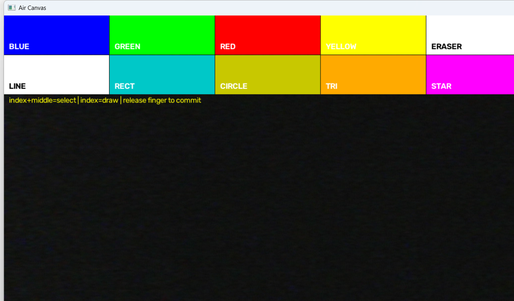

# ✋ GestureDraw — Hand-Gesture Air Canvas

**Draw, erase, undo, and export pixel art — in real time, using nothing but your hand and a webcam.**

<p align="center">
  
  
  
  
</p>

**Author:** [Mohammad Liaquat Ali](https://github.com/malik-cat)

GestureDraw turns hand gestures captured by a webcam into a virtual
whiteboard. Point with your index finger to draw, raise index + middle to
pick tools from the **top palette** or the new **left sidebar**, clear the
board with an open palm, undo mistakes, resize your brush, and export your
work as a PNG — all live, on a mirrored video feed.

<p align="center">
  
</p>

---

## ✨ Features

- **Full-canvas drawing** — every pixel on screen is drawable, edge to edge.
  Strokes are only suppressed while your fingertip is inside a UI panel.
- **Gesture debouncing** — a gesture must be stable for 3 consecutive frames
  before it acts, so a single noisy frame no longer splits a stroke into dots.
- **Three gestures:**
  - `SELECT` — index + middle raised → move the cursor / click a UI tool.
  - `DRAW` — index raised only → free-hand draw.
  - `CLEAR` — all five fingers raised → wipe the canvas.
- **Interactive top palette** — `RED` `GREEN` `BLUE` `ERASER` `CLEAR`.
- **Left sidebar** — same look, on the left edge: colours, eraser, clear,
  undo, save, and brush `+/−`. Active tool is highlighted in yellow.
- **Undo / Redo** with keyboard shortcuts (`u` / `y`) and the sidebar.
- **Save / Export** — write just the drawing to a timestamped PNG in
  `exports/` with `s` or the sidebar `SAVE` button.
- **Brush size control** — `+` / `−` and sidebar buttons.
- **On-screen feedback** — the recognized gesture name, active tool, brush
  size, and a live camera indicator are always visible.
- **First-run privacy notice** — appears once on first launch.
- **Clean exit** — `q` releases the camera and closes every window.

---

## 📦 Requirements

| Dependency  | Version |
|-------------|---------|
| Python      | 3.11+   |
| `opencv-python` | ≥ 4.8.0 |
| `mediapipe` | ≥ 1.0.0 |
| `numpy`     | ≥ 1.24.0 |
| Webcam      | any      |

> **Note:** MediaPipe 1.0.0 removed the legacy `mp.solutions` API. This
> project uses the modern **Tasks** API (`HandLandmarker`) with the bundled
> `hand_landmarker.task` model.

---

## 🚀 Getting Started

### 1. Clone the repository

```bash
git clone https://github.com/malik-cat/GestureDraw.git
cd GestureDraw
```

### 2. Install dependencies

```bash
pip install -r requirements.txt
```

### 3. Run it

```bash
python main.py
```

A window titled **GestureDraw – Air Canvas** opens showing your mirrored
webcam feed with the palette and sidebar. Raise your hand and start drawing.
Press `q` to quit.

> **Model file:** if `hand_landmarker.task` is missing, download it from
> [Google's MediaPipe models](https://storage.googleapis.com/mediapipe-models/hand_landmarker/hand_landmarker/float16/1/hand_landmarker.task)
> and place it in the project root.
>
> `air_canvas.py` still works — it is now a thin wrapper that launches the
> same app as `main.py`.

---

## 🖐️ How to Use

| Gesture                    | Action                                   |
|----------------------------|------------------------------------------|
| Index + middle fingers up  | Move cursor / click a palette sidebar tool |
| Index finger up only      | Free-hand draw                           |
| All five fingers up        | Clear the canvas                          |
| Fist / any other hand shape| Hover — no drawing                       |
| Hand out of frame          | New stroke starts on return              |

### Sidebar (left edge)

Hover your `SELECT` gesture (index + middle up) over a sidebar entry and it
activates instantly:

```
RED    GREEN   BLUE    ERASER  CLEAR
LINE   RECT    CIRCLE  TRIANGLE STAR
DRAW   UNDO    SAVE    BRUSH+  BRUSH−
```

### Drawing shapes

1. Point (`SELECT`) at a shape tool — `LINE`, `RECT`, `CIRCLE`, `TRIANGLE`,
   or `STAR` — in the sidebar or the top palette, then raise just your index
   finger (`DRAW`).
2. The first `DRAW` fingertip point **anchors** the shape.
3. Drag your finger — a live **yellow** outline previews the shape between the
   anchor and your fingertip.
4. Change gesture (or take your hand out of frame) to **commit** the shape in
   the current color/brush.

`DRAW` (in the list above) or `0` on the keyboard returns to free-hand
sketching; the shape tool stays selected so you can draw several in a row.

---

## ⌨️ Keyboard Shortcuts

| Key            | Action                   |
|----------------|--------------------------|
| `q`            | Quit                     |
| `r` / `g` / `b`| Red / Green / Blue pen   |
| `e`            | Eraser                   |
| `c`            | Clear canvas             |
| `u` / `z`      | Undo                     |
| `y`            | Redo                     |
| `s`            | Save / export PNG        |
| `1`–`5`        | LINE / RECT / CIRCLE / TRIANGLE / STAR |
| `0`            | Return to free-hand draw |
| `+` / `=`      | Increase brush size      |
| `−`            | Decrease brush size      |

---

## 🧱 Project Structure

```
GestureDraw/
├── main.py                # Application loop (entry point)
├── air_canvas.py          # Deprecated → thin wrapper around main.py
├── frame_capture.py       # Mirrored webcam capture pipeline
├── hand_tracker.py        # MediaPipe Tasks tracking + gesture debouncer
├── canvas.py              # Drawing layer, stroke logic, undo/redo, UI
├── config.py              # All thresholds, layouts, colours, shortcuts
├── tests/                 # Camera-free unit tests (pytest)
├── .github/workflows/     # CI: ruff + pytest + py_compile
├── hand_landmarker.task   # MediaPipe hand landmark model
├── requirements.txt
├── CONTRIBUTING.md
├── README.md
└── LICENSE
```

---

## 🧠 How It Works

1. **Capture** — `cv2.VideoCapture(0)` reads frames, mirrored with
   `cv2.flip(frame, 1)` so motion feels natural.
2. **Track** — MediaPipe Tasks `HandLandmarker` yields 21 landmarks per hand;
   finger state is derived by comparing each fingertip to its PIP joint.
3. **Stabilise** — a `GestureStabilizer` requires the same gesture for
   `GESTURE_STABLE_FRAMES` (3) consecutive frames before switching (`classify_stable`).
4. **Classify** — finger patterns map to `SELECT`, `DRAW`, `CLEAR`, or `NONE`.
5. **Render** — `stroke()` connects consecutive fingertip points with
   `cv2.line()` (a lone starting point draws a dot; jumps over
   `MAX_STROKE_JUMP` px start a new stroke). Strokes live on a persistent
   full-frame layer merged over the video. Shape tools use an anchor→drag→
   commit flow: the first `DRAW` point fixes the anchor, later points move a
   live yellow preview, and leaving `DRAW` bakes the shape into the layer.
   UI panels are composited on top and suppress strokes only while the cursor
   is inside them.

---

## 🔒 Privacy & Ethics

- **No network calls, ever.** GestureDraw runs entirely offline — MediaPipe
  processes frames on your device and nothing is ever sent to a server
  unless you specifically opt in.
- **No hidden disk writes.** Video frames and landmarks are kept only in
  memory. Nothing is written to disk except an explicit Save/Export
  (`s` / sidebar `SAVE`), which writes a PNG to `exports/`.
- **Camera indicator.** While the app is running a **● REC** dot is always
  shown in the window so it is never ambiguous that the webcam is live.
- **First-run notice.** On first launch an on-screen message confirms hand
  tracking is local and no data leaves the device.
- **Bystander awareness.** The webcam sees whatever is in front of it.
  If anyone else is near the camera — especially before exporting or adding
  sharing features — be mindful of what (or who) enters the frame.
- **Model licensing.** `hand_landmarker.task` is the MediaPipe Hand Landmarker
  model and is used under Google's MediaPipe license terms; see
  [Acknowledgements](#-acknowledgements).

---

## ♿ Accessibility

The gestures assume you can independently raise your index and middle fingers
against the camera. Every gesture action already has a **keyboard shortcut**
(see the table above), so the full app is usable without hand poses. A
dedicated keyboard-only mode is planned — tracked in
[issue #1](https://github.com/malik-cat/GestureDraw/issues/1).

---

## 🧪 Development

```bash
python -m pytest tests/     # 20 unit tests, no camera needed
ruff check .                # linter
```

See [CONTRIBUTING.md](CONTRIBUTING.md) for the full developer setup.

---

## 📜 Changelog

### v0.2.0

- **Continuity & robustness (Phase 1):** gesture debouncing
  (`GestureStabilizer`), first-point stroke dots, `cv2.line()` interpolation,
  and a max-jump guard against tracking glitches.
- **Full-canvas drawing (Phase 2):** the drawable layer now covers the whole
  frame edge-to-edge; strokes are suppressed only inside UI hit-zones.
- **Sidebar (Phase 3):** new left tool panel with hit-testing.
- **UX (Phase 4):** undo/redo, save-to-PNG export, brush size control, visible
  gesture feedback, and a central `config.py`.
- **Privacy (Phase 5):** on-screen REC indicator, first-run consent notice,
  and hard guarantees of no unexpected network/disk I/O.
- **Quality (Phase 6):** 20 unit tests, ruff linting, GitHub Actions CI.
  Deprecate `air_canvas.py` in favor of `main.py`.

### v0.3.0

- **Shape engine (v2 brief Phase 2):** real `LINE`, `RECT`, `CIRCLE`,
  `TRIANGLE`, and `STAR` tools with anchor → drag → commit behavior, a live
  yellow preview, and a `DRAW`/`0` "back to free-hand" tool. Select shapes
  from the sidebar or top palette or press `1`–`5`.
- **Undo history granularity (Phase 4.2):** free-hand strokes now push a single
  history snapshot when the stroke ends, so `u`/`z` undoes a whole stroke.
- **On-screen feedback (Phase 4.5):** the status line shows the active shape
  (e.g. `shape:RECT`) alongside gesture and tool.
- **Test/CI hardening (Phase 6):** camera-free smoke test that constructs the
  app (would have caught the broken-import regression), plus shape-engine and
  full-canvas edge-coverage tests. CI now installs the runtime
  `requirements.txt` (incl. MediaPipe) and compiles `shapes.py`.

---

## 📜 License

This project is licensed under the [MIT License](LICENSE). © 2026 **Mohammad Liaquat Ali**.

---

## 🙏 Acknowledgements

- [MediaPipe](https://github.com/google-ai-edge/mediapipe) — hand-landmark
  model (Google Workspace via the **Apache 2.0** license); the pre-trained
  `hand_landmarker.task` is used under Google's model card terms.
- [OpenCV](https://opencv.org) — computer-vision toolkit.